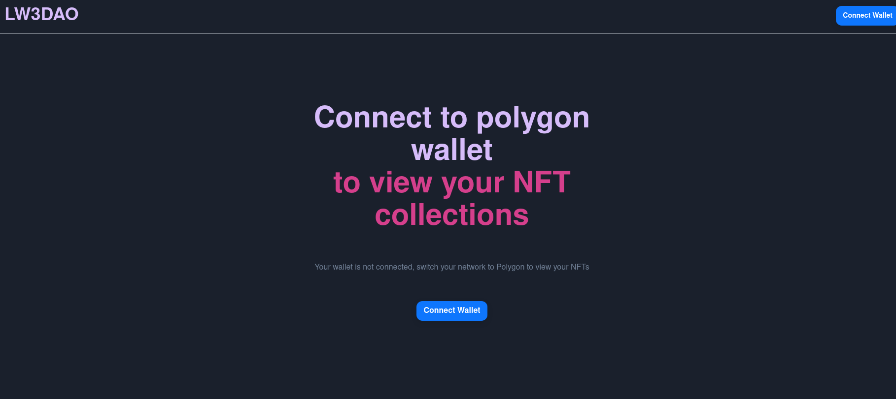

# Full stack Profile NFT development with theGraph Protocol and Next.js

This is a full stack application subgraph using Graph Protocol and Nextjs



## Getting Started

### Prerequisites

To run this app, ensure you have the following:

- Node.js installed on your machine
- MetaMask or other wallet manager extension installed

## Running this project

First, clone the Github repository:

```bash
git clone https://github.com/digitalsimboja/buildspace-lw3dao-polygon-subgraph.git

cd buildspace-lw3dao-polygon-subgraph
cd subgraph
npm install
# or
yarn
# Then change back to the frontend directory from the root of the project
cd frontend
npm install
# or
yarn
# then inside the frontend folder
npm run dev
# or
yarn dev
```

## Test

To test the app, ensure you have MetaMask or your preferred wallet manager extension installed.  
Then click the `connect` button and choose your preferred Ethereum wallet manager.

Once connected, the application would fetch your list of NFTs issued by these collections:

- https://opensea.io/collection/learnweb3
- https://opensea.io/collection/buildspace-v2
