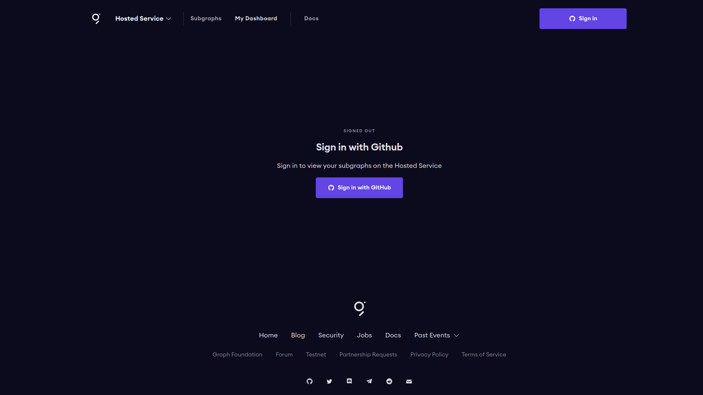

# A subgraph for fetching NFTs owned by a Wallet Address
This subgraph is used to fetch NFTs owned by a wallet address from two   
providers - LearnWeb3DAO and BuildSpace. It can be extended to fetch    
NFTs from other multiple sources by adding another `datasource` in the 
manifest.

Head over to the [Graph](https://thegraph.com/en/) protocol website to explore   
how to create new subgraphs for indexing any blockchain.  

## Prerequisites
To be able to run the application successfully, you need to have [nodejs](
    https://github.com/nvm-sh/nvm#node-version-manager---) installed on your  
machine.

## Getting started
To get started, open The [Graph Hosted Service](https://thegraph.com/hosted-service/dashboard) 
and either sign in or create a new account.  


  

Next, go to the dashboard and `Add subgraph`  

  

Configure your subgraph by filling out the information below:   
- Subgraph Name  - Choose a name
- Subtitle - A subgraph for querying NFTs
- Optional  - the description and GITHUB URL properties  


Once the subgraph is created, we will initialize the subgraph locally using the Graph CLI.  

## Initializing a new subgraph using the Graph CLI  
```
npm install -g @graphprotocol/graph-cli

# or

yarn global add @graphprotocol/graph-cli
```  

Once the Graph CLI has been installed you can initialize a new subgraph with the Graph CLI `init` command.  

First create an empty directory and cd into the new directory  
```
mkdir new_subgraph && cd new_subgraph
```  

Inside the newly created directory, run Graph init   
```
~/new_subgraph$ graph init
``` 
Complete the steps below to setup your new subgraph

- Select ethereum as the protocol when the CLI prompts you to choose
- Select hosted-service for the Product
- Enter your subgraph name that follows the format GITHUB_USERNAME/new_subgraph_name where GITHUB_USERNAME should be your Github username
- Enter subgraph for the Directory to create the subgraph in
- Select `matic` for the network
- Input the contract address of your NFT contract
